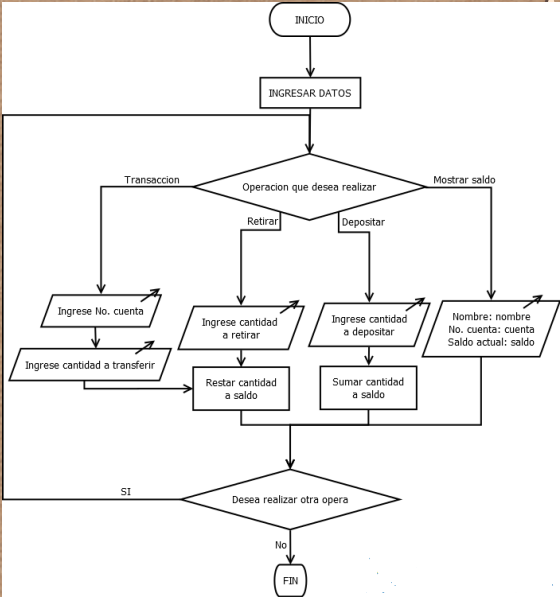

# Sistema de Banco

## Descripción
El Programa Bancario es una aplicación que emula las funciones de un banco, posibilitando a los usuarios llevar a cabo acciones como transferencias, depósitos, retiros y consultar su saldo. Asimismo, este sistema posibilita la creación de nuevas cuentas de usuario y el acceso a las mismas.

El propósito de este ejercicio consiste en desarrollar un sistema bancario empleando el lenguaje de programación Python y el enfoque de programación orientada a objetos, poniendo en práctica los conceptos aprendidos en clase sobre este paradigma de programación.
## Requerimientos

- Implementado en el lenguaje de programación Python.
- Utiliza el paradigma de programación orientada a objetos.
- Debe contar con las siguientes operaciones:
    - **Transferir**
    - **Depositar**
    - **Retirar**
    - **Mostrar saldo**
    - **Registrar usuario**
    - **Iniciar sesión**

## Diagrama de Secuencia


## Diagrama de Flujo



## Estructura del Código

A continuación, se presenta una posible estructura de clases para el sistema de banco:

### Clase Usuario

```python
class Usuario:
    def __init__(self, nombre_usuario, id_usuario, saldo):
        self.nombre_usuario = nombre_usuario
        self.id_usuario = id_usuario
        self.saldo = saldo
        self.cuentas = []

    def agregar_cuenta(self, cuenta):
        self.cuentas.append(cuenta)

```

### Clase `Cuenta`

```python
class Cuenta:
    def __init__(self):
        # Aquí puedes inicializar los atributos de la cuenta si es necesario
        pass

    # Métodos adicionales para depositar, retirar
```

### Funciones del Sistema

#### Crear Cuenta

```python
def Dar_De_Alta_Cuenta():
    nuevo_usuario, nueva_cuenta = crear_cuenta()
    usuarios.append(nuevo_usuario)
    nuevo_usuario.agregar_cuenta(nueva_cuenta)
    print("Cuenta creada exitosamente.")

def crear_cuenta():
    nombre_usuario = input("Ingrese el nombre del usuario: ")
    id_usuario = input("Ingrese el ID del usuario: ")
    saldo_inicial = float(input("Ingrese el saldo inicial de la nueva cuenta: "))
    nuevo_usuario = Usuario(nombre_usuario, id_usuario, saldo_inicial)
    nueva_cuenta = Cuenta()
    return nuevo_usuario, nueva_cuenta
```

#### Mostrar Cuenta

```python
def mostrar_cuenta():
    id_usuario = input("Ingrese el ID de usuario: ")
    usuario_encontrado = False
    for usuario in usuarios:
        if usuario.id_usuario == id_usuario:
            usuario_encontrado = True
            print("==============================")
            print(f"Nombre de usuario: {usuario.nombre_usuario}")
            print(f"ID de usuario: {usuario.id_usuario}")
            print(f"Saldo de la cuenta: {usuario.saldo}")
            print("==============================")
            break
    if not usuario_encontrado:
        print("No se encontró el usuario con el ID proporcionado.")

```

#### Depositar

```python

def depositar():
    id_usuario = input("Ingrese el ID de usuario: ")
    monto = float(input("Ingrese el monto a depositar: "))

    usuario_encontrado = False
    for usuario in usuarios:
        if usuario.id_usuario == id_usuario:
            usuario_encontrado = True
            usuario.saldo += monto
            print("Depósito realizado con éxito.")
            break

    if not usuario_encontrado:
        print("No se encontró el usuario con el ID proporcionado.")

```

#### Retirar

```python
def retirar():
    id_usuario = input("Ingrese el ID de usuario: ")
    monto = float(input("Ingrese el monto a retirar: "))

    usuario_encontrado = False
    for usuario in usuarios:
        if usuario.id_usuario == id_usuario:
            usuario_encontrado = True
            if usuario.saldo < monto:
                print("Saldo insuficiente para realizar el retiro.")
            else:
                usuario.saldo -= monto
                print("Retiro realizado con éxito.")
            break

    if not usuario_encontrado:
        print("No se encontró el usuario con el ID proporcionado.")

```

#### Transferir

```python
def transferir():
    id_origen = input("Ingrese el ID de origen de la cuenta: ")
    id_destino = input("Ingrese el ID de destino de la cuenta: ")
    monto = float(input("Ingrese el monto a transferir: "))
  


    usuario_origen = None
    usuario_destino = None

    for usuario in usuarios:
        if usuario.id_usuario == id_origen:
            usuario_origen = usuario
        elif usuario.id_usuario == id_destino:
            usuario_destino = usuario

    if usuario_origen is None:
        print("El usuario de origen no existe.")
    elif usuario_destino is None:
        print("El usuario de destino no existe.")
    elif usuario_origen.saldo < monto:
        print("Saldo insuficiente para realizar la transferencia.")
    else:
        usuario_origen.saldo -= monto
        usuario_destino.saldo += monto
        print("Transferencia realizada con éxito.")

```